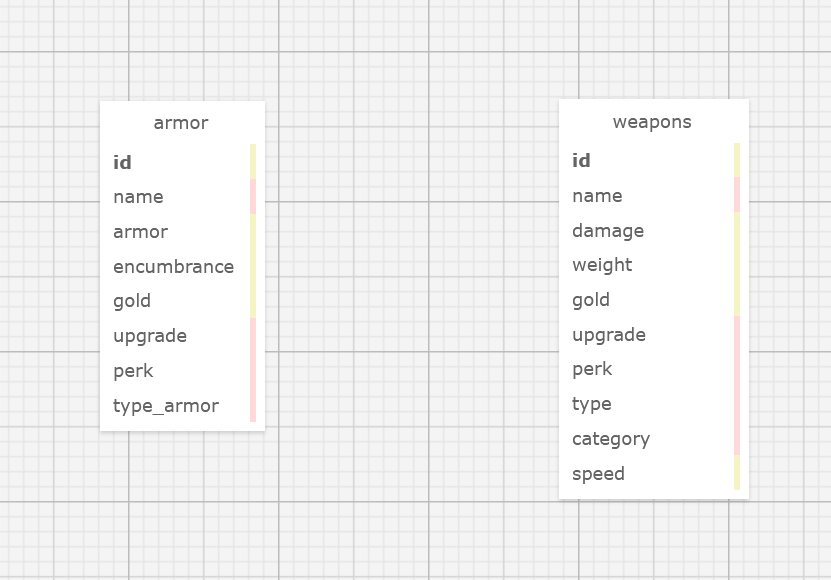

# Skyrim Weapons and Armor API
### By Emilio Roybal

This is an API that allows the user to start up and query a database filled with all the weapons and armors from the video game The Elder Scrolls V: Skyrim.

It spins up a database containing data from two datasets pulled from Kaggle, which were pulled from The Elder Scrolls Wiki.

### Schema

The database consists of two tables: weapons and armor, each consisting of similar columns. Below is the ERD for the schema.

### Installation

First type "npm install" from the root directory. When that is complete, simply type "npm run start" to launch the server.

### Endpoints

The two main endpoints are /weapons and /armor. 